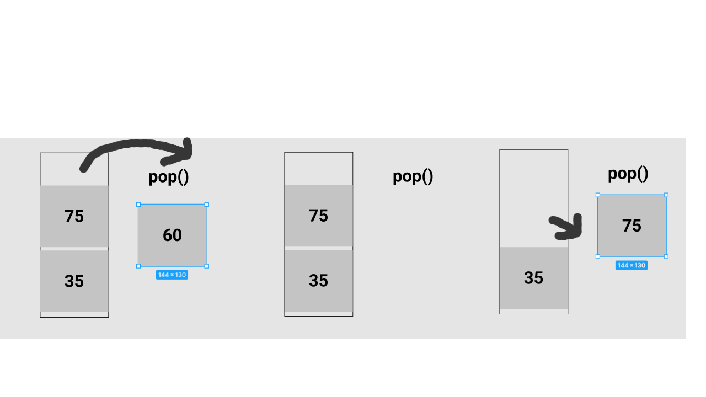

# Data Structure Stack

Stack is a data structure in IT, where use the concept of *First In Last Out* **(FILO)**

A basic concept to understand how works is think in a stack of books. 
If you get some books and put one by one, above of first and to remove you 
only can remove starting from thr top. That is the concept of Stack.

***One above another, that is the push to store the data.***

***Remove from the top of stack, like if you remove a book of a stack and you only can remove from top.***

**(sorry about the drawing is because, i don't find an image free in the internet so, I do that hsuas. Hope you can understand).**

Add in a Stack:

Remove in a Stack:

Size of a Stack:

is Include in a Stack: